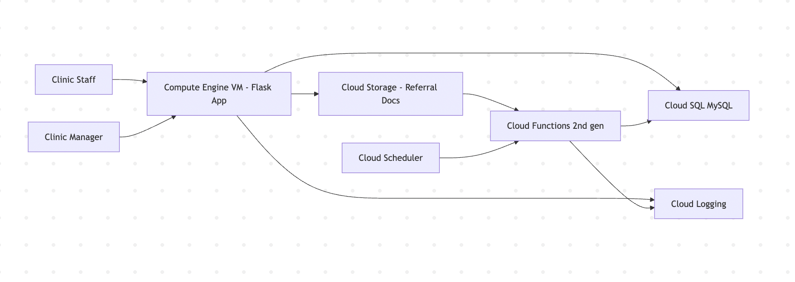

# Architecture & Implementation Plan — Referral Intake & Tracking (GCP)

## 1) Service Mapping

| Layer                                 | Service (Cloud)                                        | Role in Solution                                                                                                           | Related Assignment/Module                                             |
| ------------------------------------- | ------------------------------------------------------ | -------------------------------------------------------------------------------------------------------------------------- | --------------------------------------------------------------------- |
| Frontend / Access Layer               | **Flask app (Python)** hosted on **Compute Engine VM** | Web form/API for creating referrals, uploading documents, listing referrals, and updating statuses                         | **Assignment 2** (Deploy Flask on Cloud VM + networking)              |
| Compute Layer                         | **GCP Compute Engine**                                 | Runs the Flask application on a small VM; firewall rules allow inbound access to the app                                   | **Assignment 1** (VM lifecycle) + **Assignment 2** (Networking/ports) |
| Storage Layer                         | **GCP Cloud Storage**                                  | Stores referral attachments (PDFs/images). The database stores the file path/URL instead of the file itself                |             |
| Database/SQL Layer                    | **GCP Cloud SQL (MySQL)**                              | Stores structured referral records, status history, and optional overdue flags; accessed via SQLAlchemy                    | **Assignment 4** (MySQL on VM vs Managed Service + SQLAlchemy/pandas) |
| Serverless / Automation               | **GCP Cloud Functions (2nd gen)**                      | Triggered when a document is uploaded to Cloud Storage to validate file type/size and write document metadata to Cloud SQL | **Assignment 3** (HTTP serverless function + cloud deployment)        |
| Scheduling | **GCP Cloud Scheduler**                                | Runs a daily job to check for overdue referrals (past due date) and flag them in Cloud SQL                                 | (Adds operational automation + cost-efficient)                        |
| Monitoring / Logs                     | **Cloud Logging**                                      | Central logging for VM/app (via agent), Cloud Functions logs, and basic troubleshooting                                    |                                            |

---

## 2) Data Flow Narrative (End-to-End)

**Step 1 — Referral submission (Flask on VM)**
A clinic staff member submits a referral using a Flask web form or API endpoint (e.g., `/referrals/create`). The submission includes structured fields (specialty, reason, priority, due date) and an optional document upload (PDF/image).

**Step 2 — Store documents (Cloud Storage)**
If a document is attached, the Flask app uploads it to a Cloud Storage bucket. The object path follows a consistent naming scheme, for example:
`gs://referral-docs-bucket/referrals/<referral_id>/<timestamp>_<filename>.pdf`

**Step 3 — Persist referral record (Cloud SQL MySQL)**
The Flask app inserts a row into Cloud SQL (MySQL) for the referral, including:

* referral details (specialty, reason, priority)
* current status (initially `SUBMITTED` or `RECEIVED`)
* document storage path (GCS URL/path)
* timestamps and due date

**Step 4 — Upload trigger automation (Cloud Functions)**
A Cloud Function triggers on the Cloud Storage “object finalize” event. The function:

* verifies allowed file types (PDF/JPG/PNG)
* checks file size thresholds
* writes/updates document metadata in Cloud SQL (file name, size, upload timestamp)
* optionally updates status to `RECEIVED` if the referral had a document successfully uploaded

**Step 5 — Referral work queue (Flask reads from Cloud SQL)**
Staff use the Flask app to:

* list referrals by status (e.g., `RECEIVED`, `IN_REVIEW`, `SCHEDULED`)
* open a referral record (view fields + link to document)
* update status (e.g., `/referrals/<id>/status`)

When statuses are updated, the app also writes to a `referral_status_history` table for basic auditability.

**Step 6 — Overdue detection (Cloud Scheduler + Function OR VM endpoint)**
A daily scheduled job checks referrals where `due_date < today` and status is not in a terminal state (e.g., not `COMPLETED` or `CLOSED`). It flags overdue referrals in the database (either in an `overdue_flags` table or a boolean column like `is_overdue`).

**Step 7 — Manager view / reporting (Flask queries Cloud SQL)**
The Flask app shows:

* overdue referrals
* counts by status
* average time in each stage 

This completes a realistic “intake → storage → automation → tracking → escalation” workflow.

---

## 3) Security, Identity, and Governance Basics

**Credential management**
For a real deployment, credentials should not be hard-coded. The Flask app should use environment variables for configuration and ideally use a managed secret solution for database credentials. 

**Access control / IAM (RBAC)**
At minimum, the solution would use distinct IAM service accounts with least privilege:

* The **Flask VM service account** needs permission to:

  * upload to Cloud Storage (write objects)
  * connect to Cloud SQL (Cloud SQL Client role + DB user/password)
* The **Cloud Function service account** needs permission to:

  * read object metadata from the bucket
  * connect to Cloud SQL to write metadata / update status

Application roles (referral coordinator vs manager) could be implemented later, but the design assumes role-based access is required in production.

**PHI handling and governance**
The system should minimize PHI exposure by:

* storing documents in Cloud Storage with restricted IAM access (not public)
* storing only the document link/path in the database (not embedding files in SQL)
* logging operational events carefully (avoid logging PHI payloads)
* using encryption at rest (default) and TLS in transit
* using test data for demos and prototypes, and never placing real PHI in public environments

---

## 4) Cost and Operational Considerations

**What might cost the most**
The largest ongoing cost driver is typically the **database (Cloud SQL)** because it runs continuously and may require a minimum instance size. Storage costs are usually low for small numbers of PDF/image files. Cloud Functions and Scheduler are generally low-cost at small scale.

**Keeping it student-budget friendly**
To keep costs low:

* use a small Compute Engine VM (or stop it when not testing)
* keep Cloud SQL on the smallest tier appropriate for development
* store only small test documents in Cloud Storage

**Operational reliability and maintenance**
Using Cloud SQL reduces the operational burden compared with running MySQL on a VM (patching, backups, upgrades). Cloud Storage provides durable object storage for documents. Cloud Logging supports troubleshooting and basic observability for both the app and serverless components.

## Architecture Diagram

